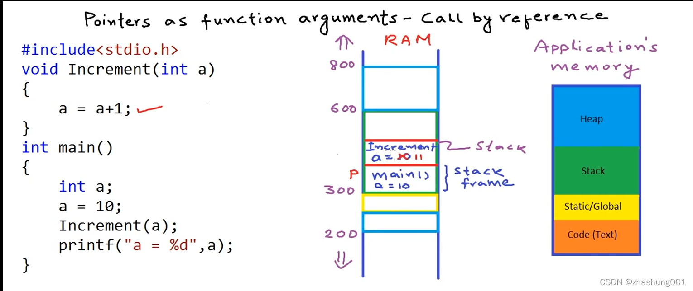
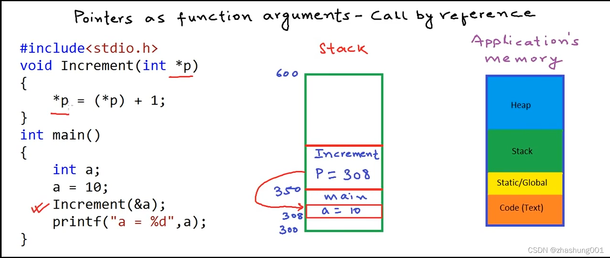

1. c语言的.c文件中必须要有

```c
int main(){
}
```

```c
int a = 10;
int *p;
p = &a;//p称为指针变量，它也是变量，它存的是赋值给它的变量的内存地址
       //&取地址、*解引用、&引用
```

2. 指针的算术运算只有加减（整数值）如：P+1，P+2

   1. 指针P的加减实际上是对内存上的地址的加减，且每次的变化取决于指针的类型，int-4byte，char-1byte。所以，int型的P，P+1实际上是地址 + 4。

   1. 危险!!!。C语言不会对我们访问的地址进行检查，通过指针访问一块未分配的地址，也是可以的，但是这样有可能产生一些错误的数值（垃圾数）。

3. 指针是强类型的，要明确指针的类型。我们不仅需要将变量地址存储到指针中，同时还需要使用指针进行解引用和写数据。

   > 1，2，3的三种类型赋值都需要强制转换，如：
   >
   > ```c
   > int a = 1025;
   > int* p = &a; 
   > char* p0; 
   > p0 = (char*)p;//(char*)是一种强制类型转换，
   >              //表示把int*类型变量p强制转换为char*
   > ```

   1. int* p -4byte
   2. char* p -1byte
   3. float* p -4byte
   4. void* p 通用指针类型，无需类型转换，直接赋值任意指针类型数值，但只能打印地址 ，不能解引用（*)与算数运算。

4. 指向指针的指针

   ```c
   int x = 5;
   int* p = &x;//指针p存放的是x的内存地址
   *p = 6;//*p是p中存的地址所存的变量即x，可以直接将其重新赋值
   int** q = &p;//q存的是p的地址，*q取的是p中的地址，
                //**q取的是*p中的变量，即p中的地址处所存的变量
   int***r = &q;//同理r存的是q的地址
   printf("%d\n", *p); 
   printf("%d\n", *q); 
   printf("%d\n", *(*q)); 
   printf("%d\n", *(*r)); 
   printf("%d\n", *(*(*r))); 
   ```

   其内存模型如下，我们可以更方便的查看变量里面所存储的数值。

   可以看到指针操作内存的便捷。

   

5. 指针作为函数参数

   1. 按值传递-实参映射到形参

   ```c
   #include<stdio.h>
   void Increment(int a)//a为形参，called function
   {
       a = a+1;
       printf("%d\n", &a);
   }
   int main()//calling function
   {
       int a;
       a = 10;
       Increment(a);//a为实参
       printf("a=%d\n", a);
       printf("%d\n", &a);
   }
   ```

   首先以上面代码为例解释函数按值传递。

   在`main`函数中，我们定义了变量`a`，并试图调用`Increment`函数使`a`增加1。但是当我们测试时，`a`的值并没有如愿+1=11。

   我们同时打印了`a`在`main`函数和`Increment`函数中的地址，我们发现两者地址是不一样的，即两个函数中的`a`并不是同一个`a`，因此在`main`函数中的`a`并没有+1。

   

   如上图右侧，是一个**典型应用程序所使用的内存的分布**，包括了代码区、全局区、栈区、堆区（程序在开始运行时stack，static和code的大小就已经固定了）。（这里不详细介绍每个区的用处， 且图中栈和堆的位置与常识相颠倒）。如中间内存模型所示，函数中的变量（称为局部变量）是放在栈区的，如图中内存地址300-600的绿色框。首先调用`main`函数，系统将在栈区开辟一块内存（称为栈帧stack frame）存放`main`函数，并在`main `所属区域中找到一块内存给变量``a`，如`a = 10`；接着在`main`中调用了函数`Increment`，系统将在stack中继续为`Increment`函数开辟一块栈帧，并给其内部变量分配地址，接着复制一份`main`函数中的`a`到`Increment`函数中的`a`，因此我们将`Increment`函数中的`a`+1，并不影响在`main`函数中的`a`，因为两个`a`是分属于两个不同函数的两个不同的局部变量。

   因此这种将一个函数中的变量（称为实参）通过复制的方式传递给被调函数的参数（称为形参），改变形参并不影响实参，这种传递方式称为**按值传递**。

   2. 按指针传递（本视频中为传引用 call by reference）

   ```c
   //这种方法可以在`Increment`函数中修改`main`函数中的`a`
   #include<stdio.h>
   void Increment(int* p)
   {
       *p = *p+1;
   }
   int main()
   {
       int a;
       a = 10;
       Increment(&a);
       printf("a=%d\n", a);
   }
   ```

   在该代码中将`main`函数中的`a`的地址传递给`Increment`函数中的变量`p`，通过解引用直接修改对应地址处（即`mian`函数中的`a`）的数值，达到目的。如下图中间部分内存模型所示：

   

   将`a`的内存地址308传给`Increment`函数中的变量`p`，即变量`p`指向了`main`函数中的变量`a`，使用解引用即可达到修改`main`函数中的`a`的目的。这种通过将变量的指针传递给被调函数达到修改变量的传递方式称为按**指针传递**（视频中称为按引用传递，在C++中应该将其区分）。

   当变量占用内存比较大时，相比于按值传递，指针传递是一种更为高效的方式。

