赵春雨
---

余额 21.34 书币 · 体验卡剩余 14 天

下载微信读书 App 管理书架

[

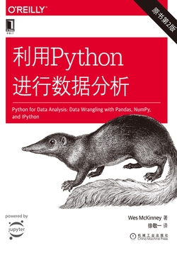

利用Python进行数据分析（原书第2版）

](https://weread.qq.com/web/reader/75b321f0715afbc075b7c2c)[

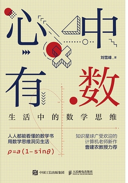

心中有数 生活中的数学思维

](https://weread.qq.com/web/reader/df6323a0813ab6de5g019a31)[

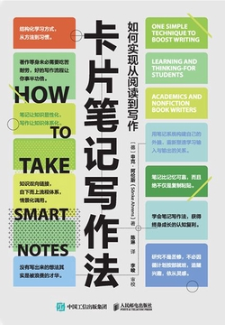

卡片笔记写作法：如何实现从阅读到写作

](https://weread.qq.com/web/reader/3d8326d072552e803d87c41)[

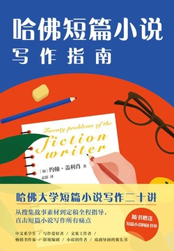

哈佛短篇小说写作指南

](https://weread.qq.com/web/reader/c4d322b0720d45e4c4df194)[

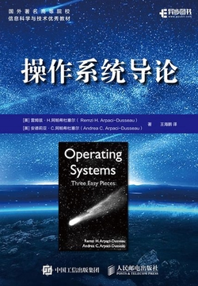

操作系统导论

](https://weread.qq.com/web/reader/db8329d071cc7f70db8a479)[

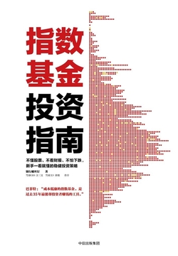

指数基金投资指南

](https://weread.qq.com/web/reader/d6b324105e0e02d6b1ec8cf)[

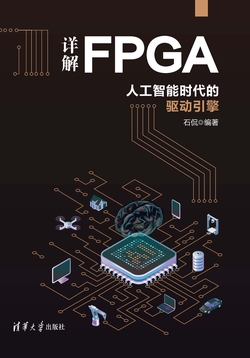

详解FPGA：人工智能时代的驱动引擎

](https://weread.qq.com/web/reader/b74327b0813ab6bf9g010370)[

哦，加拿大：1867-2017 O，Canada：from 1867to 2017（英文版）

](https://weread.qq.com/web/reader/f36329705e058cf361ca689)[

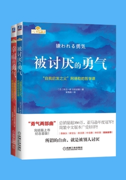

勇气两部曲：“自我启发之父”阿德勒的哲学课纪念套装（共2册）

](https://weread.qq.com/web/reader/ec73249072054fb6ec77894)[

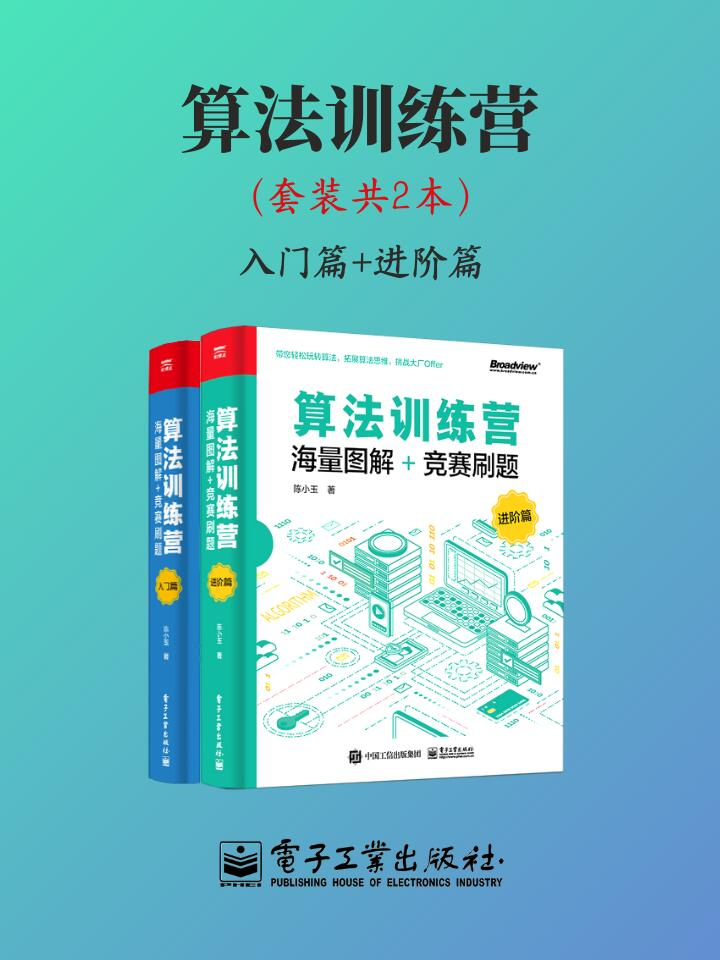

算法训练营（套装共2本）

](https://weread.qq.com/web/reader/217429f2a43425f38666b43624d436373304c5336626136635a835)[

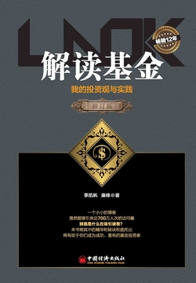

解读基金：我的投资观与实践（修订版）

](https://weread.qq.com/web/reader/213325907198b82a213eb72)[

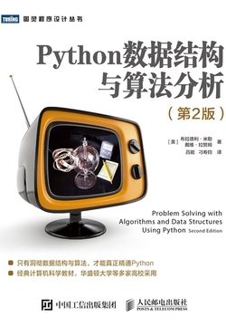

Python数据结构与算法分析（第2版）

](https://weread.qq.com/web/reader/9143210071c95624914946b)[

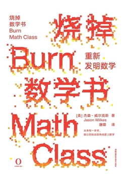

烧掉数学书：重新发明数学

](https://weread.qq.com/web/reader/71832e007260a75e718c6fb)[

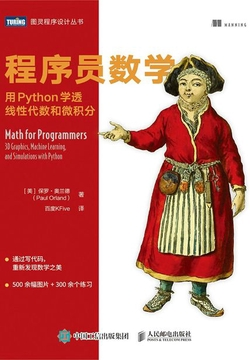

程序员数学：用Python学透线性代数和微积分

](https://weread.qq.com/web/reader/818320a0728a4acc8189214)[

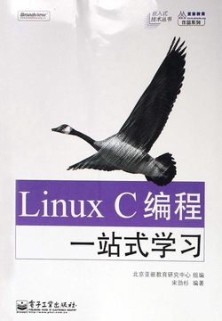

Linux C编程：一站式学习

](https://weread.qq.com/web/reader/7ef325905a7edb7efd19f32)[

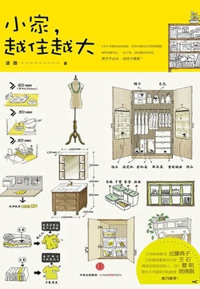

小家，越住越大

](https://weread.qq.com/web/reader/73e32750719358cb73ef5f9)[

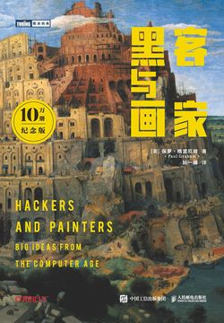

黑客与画家（10万册纪念版）

](https://weread.qq.com/web/reader/5b9328f05dd9fb5b922d1eb)[

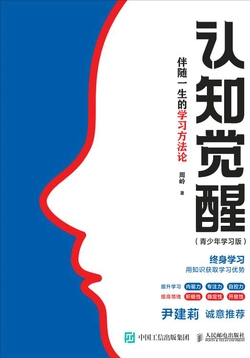

认知觉醒：伴随一生的学习方法论（青少年学习版）

](https://weread.qq.com/web/reader/0a332e00813ab7400g010246)[

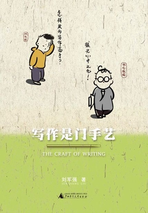

写作是门手艺

](https://weread.qq.com/web/reader/d0d321b072106c98d0dc46a)[

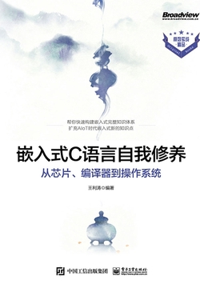

嵌入式C语言自我修养：从芯片、编译器到操作系统

](https://weread.qq.com/web/reader/e9e326b0723ec980e9e9dfd)[

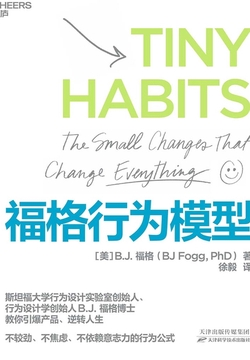

福格行为模型

](https://weread.qq.com/web/reader/614325a07273de5c614b852)[

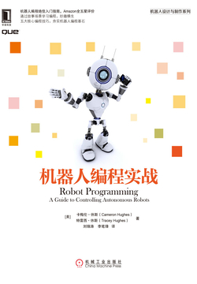

机器人编程实战

](https://weread.qq.com/web/reader/29832500720bfc8729892d4)[

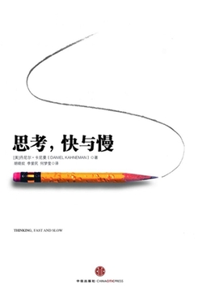

思考，快与慢

](https://weread.qq.com/web/reader/af83263058c217af81f8979)[

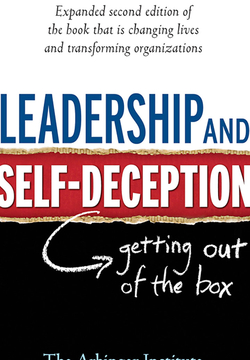

Leadership and Self-Deception

](https://weread.qq.com/web/reader/c14329d07188bf2cc146082)[

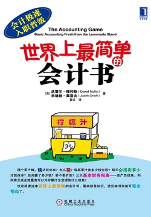

世界上最简单的会计书

](https://weread.qq.com/web/reader/1cb32c70597d451cb6e5dcb)[

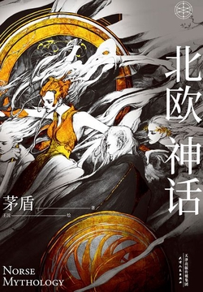

北欧神话

](https://weread.qq.com/web/reader/a54329e071ef1118a54a60b)[

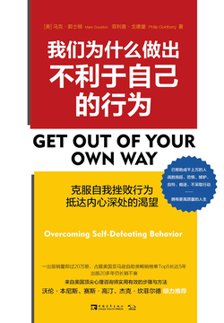

我们为什么做出不利于自己的行为

](https://weread.qq.com/web/reader/ac332d8071f93715ac38583)[

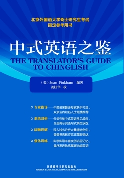

中式英语之鉴

](https://weread.qq.com/web/reader/21132ee0813ab6d5dg012ed5)[

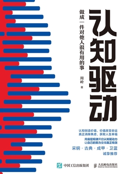

认知驱动：做成一件对他人很有用的事

](https://weread.qq.com/web/reader/eb032730726c4502eb0ff73)[

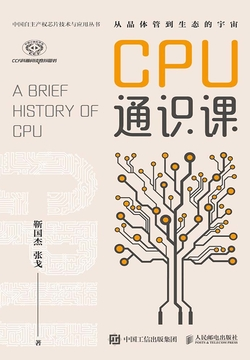

CPU通识课

](https://weread.qq.com/web/reader/3023296072922e853025472)[

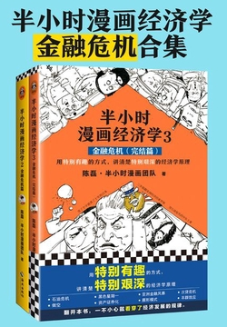

半小时漫画经济学：金融危机合集（独家定制版）

](https://weread.qq.com/web/reader/f303216071c76967f30128c)[

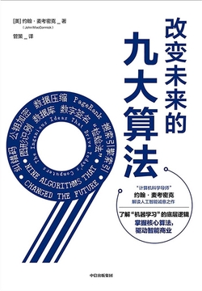

改变未来的九大算法

](https://weread.qq.com/web/reader/ca332270717d45ebca3214d)[

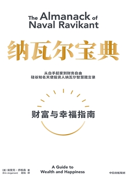

纳瓦尔宝典

](https://weread.qq.com/web/reader/e1e32b00729fc94fe1e824d)[

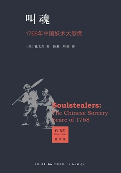

叫魂：1768年中国妖术大恐慌

](https://weread.qq.com/web/reader/675326e0813ab6ffcg019c10)[

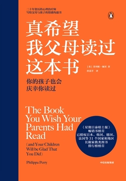

真希望我父母读过这本书

](https://weread.qq.com/web/reader/975320b071f9ad25975dc75)[

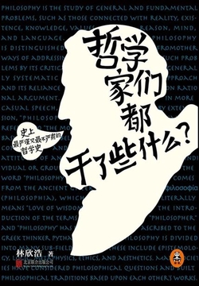

哲学家们都干了些什么

](https://weread.qq.com/web/reader/617329405c895e617dba09b)[

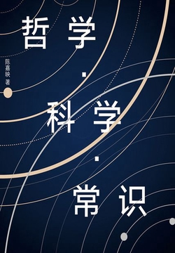

哲学·科学·常识

](https://weread.qq.com/web/reader/d9a32fe05e3cc6d9ae19c25)[

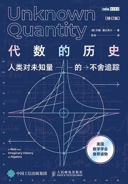

代数的历史：人类对未知量的不舍追踪（修订版）

](https://weread.qq.com/web/reader/8eb326c0723be76c8ebd4a5)[

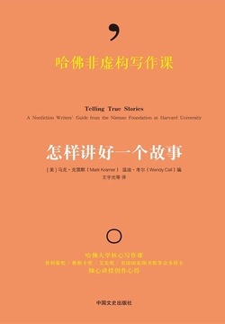

哈佛非虚构写作课：怎样讲好一个故事

](https://weread.qq.com/web/reader/7e932f907166b2fc7e991bb)[

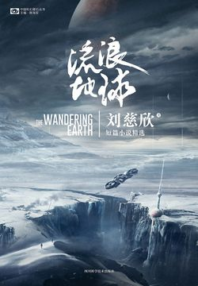

流浪地球

](https://weread.qq.com/web/reader/4db32510717f891b4dbdaca)[

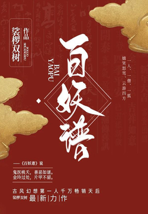

百妖谱（同名动漫原著）

](https://weread.qq.com/web/reader/cd4322b071ef469bcd4a639)[

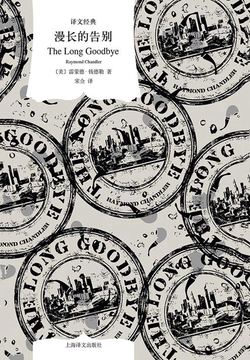

漫长的告别（译文经典）

](https://weread.qq.com/web/reader/9f832a1071d61df19f8722d)[

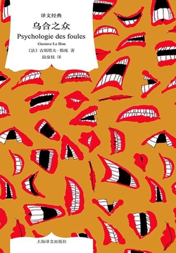

乌合之众（译文经典）

](https://weread.qq.com/web/reader/03132cc0719978940319f1e)[

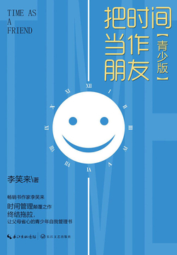

把时间当作朋友（青少版）

](https://weread.qq.com/web/reader/6bb321f07183b76c6bb384f)[

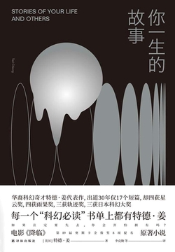

你一生的故事（译林幻系列）

](https://weread.qq.com/web/reader/cef32470719bdd31cef5a8a)[

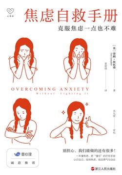

焦虑自救手册：克服焦虑一点也不难（樊登推荐，克服焦虑实用指南）

](https://weread.qq.com/web/reader/07b32740813ab6ad4g014703)[

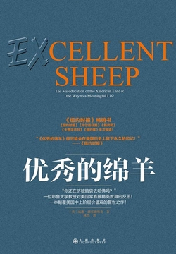

优秀的绵羊

](https://weread.qq.com/web/reader/68532c205ccc3d685319c9a)[

制造消费者：消费主义全球史

](https://weread.qq.com/web/reader/bc732ce0813ab6e0dg01666c)[

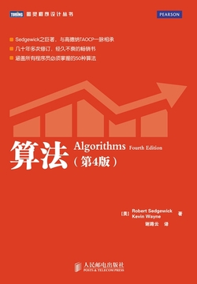

算法（第4版）

](https://weread.qq.com/web/reader/7cc32910718ff66b7cc8d9d)[

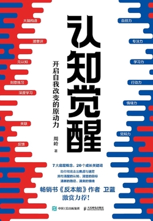

认知觉醒：开启自我改变的原动力

](https://weread.qq.com/web/reader/6a732ce07201202c6a7b30a)[

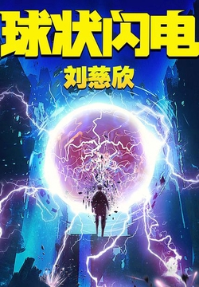

三体前传：球状闪电

](https://weread.qq.com/web/reader/6b832220718529276b89a0a)[

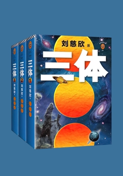

三体（全集）

](https://weread.qq.com/web/reader/ce032b305a9bc1ce0b0dd2a)[

写作这回事：创作生涯回忆录（经典写作课）

](https://weread.qq.com/web/reader/a8232570813ab67b5g01534b)